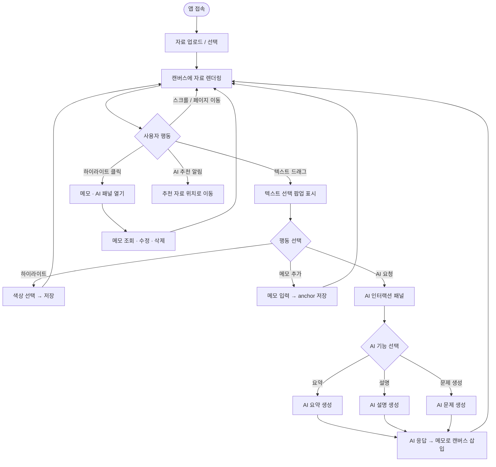
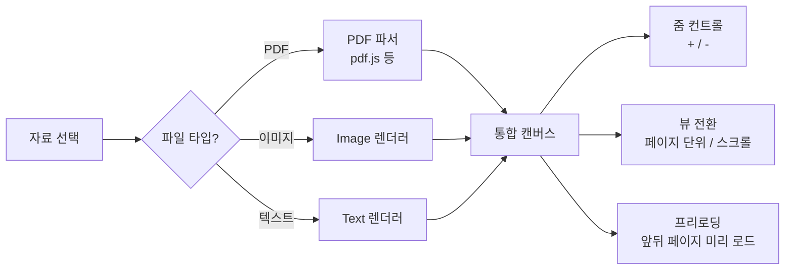
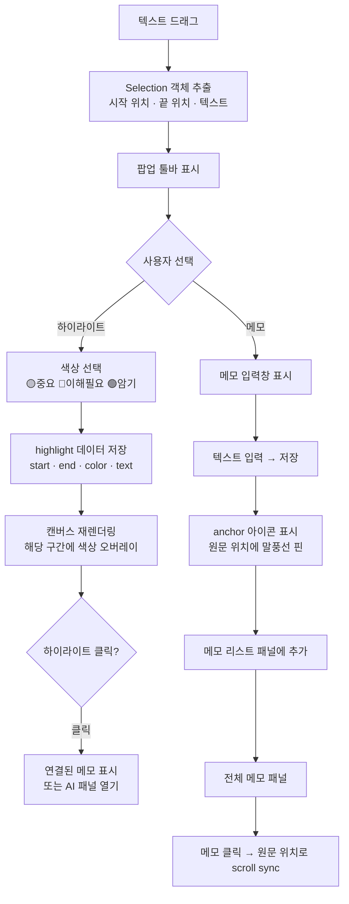
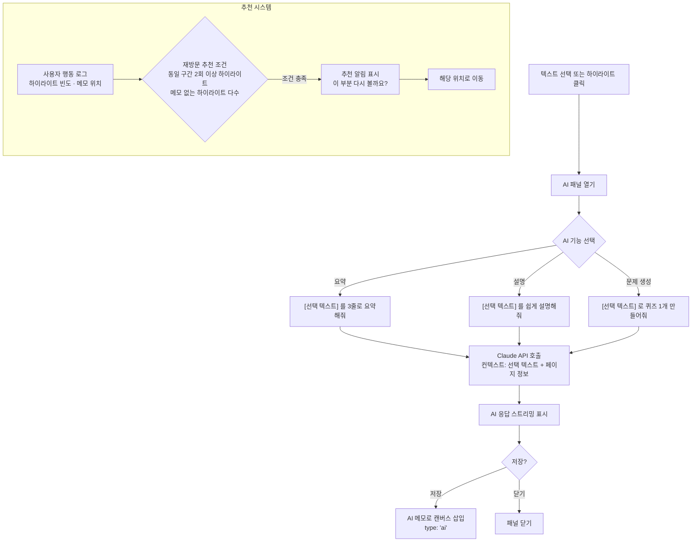

# Co-Study 학습 도우미 — 기능 명세 및 사용자 플로우

> v0.1 · 2026-04-04  
> 디자인씽킹 팀 프로젝트 MVP 구현 참고용

---

## 1. 제품 개요

PDF·이미지·텍스트 자료를 불러와, 하이라이트·메모·AI 인터랙션으로 학습을 돕는 웹 애플리케이션.

**핵심 가치:** 자료를 보면서 곧바로 이해하고, 기록하고, AI에게 물어볼 수 있다.

---

## 2. 기능 목록

| 번호 | 기능명 | 분류 |
|------|--------|------|
| 2-1 | 자료 렌더링 | Core |
| 2-2 | 텍스트 선택 (하이라이트 · 메모) | Core |
| 2-3 | AI 학습 인터랙션 | 차별화 |

---

## 3. 전체 사용자 플로우



---

## 4. 기능별 상세 플로우

### 4-1. 자료 렌더링 (2-1)



**상태값**

| 상태 | 설명 | 초기값 |
|------|------|--------|
| `currentPage` | 현재 페이지 번호 | 1 |
| `zoomLevel` | 확대 배율 | 1.0 |
| `viewMode` | `'page'` \| `'scroll'` | `'page'` |
| `isLoading` | 로딩 여부 | false |

---

### 4-2. 텍스트 선택 · 하이라이트 · 메모 (2-2)



**중복 하이라이트 처리 규칙**

```
기존 구간과 겹칠 경우:
  - 완전 포함: 새 색상으로 덮어쓰기
  - 부분 겹침: 겹치는 구간은 새 색상 적용, 나머지 유지
  - 동일 구간: 색상만 변경
```

**데이터 구조**

```json
// highlight
{
  "id": "hl_001",
  "pageIndex": 2,
  "startOffset": 140,
  "endOffset": 210,
  "text": "선택된 텍스트 내용",
  "color": "yellow",
  "memoId": "memo_001"   // 연결된 메모 (없으면 null)
}

// memo
{
  "id": "memo_001",
  "highlightId": "hl_001",
  "pageIndex": 2,
  "anchorOffset": 140,
  "content": "메모 내용",
  "createdAt": "2026-04-04T12:00:00Z",
  "type": "manual"       // "manual" | "ai"
}
```

---

### 4-3. AI 학습 인터랙션 (2-3)



**AI 호출 컨텍스트 구조**

```
시스템 프롬프트:
  "학습 도우미입니다. 학생이 선택한 텍스트에 대해 [기능]을 수행하세요.
   응답은 간결하게, 학습에 도움이 되도록."

유저 메시지:
  선택 텍스트: {selectedText}
  페이지: {pageIndex}
  요청: {요약 | 설명 | 문제 생성}
```

---

## 5. 화면 레이아웃 구조

```
┌─────────────────────────────────────────────────┐
│  상단 툴바                                        │
│  [자료명]  [뷰 전환]  [줌 -][100%][줌 +]  [메모 패널]  │
├──────────────────────────┬──────────────────────┤
│                          │                      │
│      메인 캔버스          │   사이드 패널          │
│  (PDF / 이미지 / 텍스트)  │   (메모 리스트)        │
│                          │                      │
│  ████████████████████    │  ┌ memo_001 ────────┐│
│  ██ 하이라이트 구간 ██    │  │ 2p · 하이라이트  ││
│  ████████████████████    │  │ "메모 내용..."   ││
│                          │  └──────────────────┘│
│  📌 메모 핀              │                      │
│                          │  ┌ memo_002 ────────┐│
│                          │  │ 3p · AI 요약     ││
│                          │  │ "AI 응답..."     ││
│                          │  └──────────────────┘│
├──────────────────────────┴──────────────────────┤
│  하단: 페이지 네비게이션  ← 2 / 12 →              │
└─────────────────────────────────────────────────┘

[텍스트 드래그 시 팝업]
  ┌──────────────────────────┐
  │ 🟡 🔵 🟢  📝 메모  🤖 AI │
  └──────────────────────────┘
```

---

## 6. 컴포넌트 구조 (구현 참고)

```
src/
├── components/
│   ├── Canvas/
│   │   ├── DocumentCanvas.jsx     # 메인 캔버스 (PDF·이미지·텍스트 통합)
│   │   ├── HighlightLayer.jsx     # 하이라이트 오버레이
│   │   ├── MemoPin.jsx            # 메모 anchor 핀
│   │   └── SelectionToolbar.jsx   # 텍스트 선택 시 팝업 툴바
│   ├── Sidebar/
│   │   ├── MemoPanel.jsx          # 전체 메모 리스트
│   │   └── MemoCard.jsx           # 개별 메모 카드
│   ├── AI/
│   │   ├── AIPanel.jsx            # AI 기능 선택 + 응답 표시
│   │   └── useAI.js               # Claude API 호출 훅
│   └── Toolbar/
│       └── TopToolbar.jsx         # 뷰 전환, 줌 컨트롤
├── hooks/
│   ├── useHighlight.js            # 하이라이트 CRUD
│   ├── useMemo.js                 # 메모 CRUD
│   └── useRecommend.js            # 추천 로직
└── lib/
    ├── pdfParser.js               # PDF 파싱
    └── selectionUtils.js          # 텍스트 선택 좌표 계산
```

---

## 7. 기술 스택 제안

| 영역 | 라이브러리 | 이유 |
|------|-----------|------|
| PDF 렌더링 | `react-pdf` (pdf.js) | 페이지 단위 렌더링, 텍스트 레이어 지원 |
| 텍스트 선택 | 네이티브 Selection API | 추가 의존성 없음 |
| AI | Anthropic Claude API | 팀 기존 스택 |
| 상태 관리 | Zustand | 가볍고 훅 기반 |
| 데이터 저장 | Firebase Firestore | 팀 기존 스택 |
| 배포 | Vercel | 팀 기존 스택 |

---

## 8. 미결 사항 (구현 전 결정 필요)

- [ ] 이미지 자료의 텍스트 선택 방식 — OCR 도입 여부
- [ ] 하이라이트·메모 데이터 저장 위치 — 로컬(localStorage) vs Firebase (멀티유저 여부)
- [ ] AI 추천 트리거 조건 구체화
- [ ] 모바일 터치 드래그 선택 UX 처리 방식
